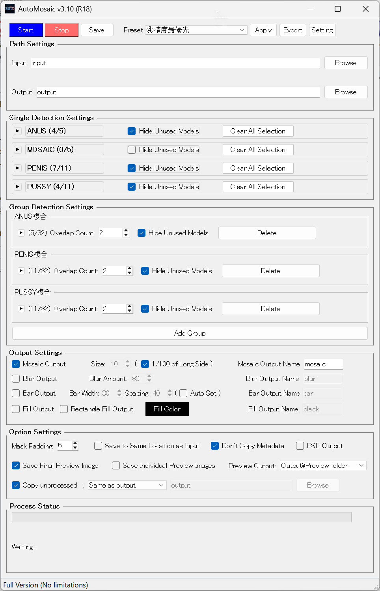

# nekzuk.com 個別製品ページ共通改善ガイド

## 概要

このドキュメントは nekzuk.com の個別製品ページに対する改善内容と進捗を管理するものです。
Round 1・Round 2 は完了済み。未対応項目は Round 3 セクションにまとめています。

---

## 対象ページ一覧（日英ペア）

| 製品名            | 英語                  | 日本語                  |
| ----------------- | --------------------- | ----------------------- |
| AutoMosaic R18    | automosaic-r18.html   | automosaic-r18_j.html   |
| AutoMosaic 通常版 | automosaic.html       | automosaic_j.html       |
| AI Paint Cleaner  | ai-paint-cleaner.html | ai-paint-cleaner_j.html |
| NAI Smart Studio  | nai-smart-studio.html | nai-smart-studio_j.html |
| AI Meta Cleaner   | ai-meta-cleaner.html  | ai-meta-cleaner_j.html  |
| Frame Craft       | frame-craft.html      | frame-craft_j.html      |
| Meta Converter    | meta-converter.html   | meta-converter_j.html   |

### slug 一覧

| slug             | 製品              |
| ---------------- | ----------------- |
| automosaic-r18   | AutoMosaic R18版  |
| automosaic       | AutoMosaic 通常版 |
| ai-paint-cleaner | AI Paint Cleaner  |
| nai-smart-studio | NAI Smart Studio  |
| ai-meta-cleaner  | AI Meta Cleaner   |
| frame-craft      | Frame Craft       |
| meta-converter   | Meta Converter    |

**注意**: index.html / index_j.html は修正済み（2026-02-06）。対象外。

---

## 修正履歴

### Round 1（2026-02-06 完了）✅

ガイド初版の修正項目 1〜6 を全14ファイルに適用。

| # | 修正内容 | 対象 | 状態 |
|---|----------|------|------|
| 1 | `og:url` の `?lang=en` 削除・各ページ自身のURLに修正 | 全14ファイル | ✅ |
| 2 | 日本語ページの `<meta name="description">` を日本語化 | automosaic-r18_j, ai-paint-cleaner_j | ✅ |
| 3 | 日本語ページの `<title>` にキーワード追加 | 全7 _j.html | ✅ |
| 4 | 日本語ページの `og:title` / `twitter:title` を日本語化 | automosaic-r18_j, ai-paint-cleaner_j, nai-smart-studio_j | ✅ |
| 5 | `canonical` / `hreflang` / `og:locale` を `<!-- Language SEO -->` 直下に整形移動。`</head>` 直前の圧縮行を削除 | 全14ファイル | ✅ |
| 6 | 日本語ページの `og:description` / `twitter:description` を日本語化 | automosaic-r18_j, ai-paint-cleaner_j | ✅ |

**追加クリーンアップ（Round 1 で同時対応）:**

- 一部ファイルに残っていた `<meta name="twitter:url">` タグを削除
- `<!-- Canonical tag (dynamic) -->` コメントを削除

**補足:** 修正不要だったページ（既に日本語化済み）: automosaic_j, ai-meta-cleaner_j, frame-craft_j, meta-converter_j, nai-smart-studio_j（description のみ）

---

### Round 2（2026-02-06 完了）✅

Round 1 完了後のレビューで発見された追加改善項目を適用。

| # | 修正内容 | 対象 | 状態 |
|---|----------|------|------|
| ① | NAI Smart Studio に JSON-LD 追加（`SoftwareApplication` + `BreadcrumbList`） | nai-smart-studio.html, nai-smart-studio_j.html | ✅ |
| ② | 日本語ページの JSON-LD `featureList` を日本語化 | 全6 _j.html（nai-smart-studio_j 除く ※①で日本語作成済み） | ✅ |
| ② | 日本語ページの JSON-LD `video.name` / `video.description` を日本語化 | automosaic-r18_j, automosaic_j, ai-paint-cleaner_j | ✅ |
| ③ | 日本語ページの JSON-LD `screenshot` を日本語版UI画像に変更 | 全6 _j.html（nai-smart-studio_j 除く） | ✅ |
| ⑤ | `og:site_name` 追加 (`"nekzuk Software"`) | 全14ファイル | ✅ |
| ⑥ | `og:type` を `website` → `product` に変更 | 全14ファイル | ✅ |
| ⑧ | `loading="lazy"` をファーストビュー外の `` に追加 | 全14ファイル | ✅ |
| ⑨ | `preconnect` ヒント追加（`googletagmanager.com`, `i.ytimg.com`） | 全14ファイル | ✅ |

---

## Round 3：未対応項目（次回作業用）

このセクションの項目は、次回チャットでこのMDファイルと対象HTMLを渡して作業を依頼すること。

---

### R3-1. NAI Smart Studio JSON-LD のリリース後更新【リリース時に対応】

**現状:** NAI Smart Studio の JSON-LD は `availability` を `PreOrder` に設定している。
offer の URL も仮のもの（EN: `https://payhip.com/nekzuk`、JP: `https://synekzuk.booth.pm/`）。

**リリース後に必要な修正:**

```
nai-smart-studio.html:
  - "availability": "https://schema.org/PreOrder" → "https://schema.org/InStock"
  - "url": 実際の Payhip 商品ページ URL に変更

nai-smart-studio_j.html:
  - "availability": "https://schema.org/PreOrder" → "https://schema.org/InStock"
  - "url": 実際の BOOTH 商品ページ URL に変更
```

**同時に確認すべき点:**

- `softwareVersion` が正しいか（現在 `"1.0"`）
- 価格が確定値と一致しているか（EN: `$20`、JP: `¥2,000`）
- 紹介動画が完成したら `video` プロパティを追加（他の製品ページの JSON-LD を参考）

---

### R3-2. OG画像の改善（`og:image` / `twitter:card`）【中】

**現状:** 全ページの `og:image` がアプリアイコン（小さい正方形 PNG）。
`twitter:card` は `summary`（小サムネイル表示）。

**推奨対応:**

1. 各製品用の OG 画像を作成（推奨サイズ: 1200×630px）
   - 製品名 + UIスクリーンショット + ロゴを含むバナー画像が理想
2. `twitter:card` を `summary_large_image` に変更
3. `og:image:width` / `og:image:height` メタタグを追加

```html
<!-- 修正後の例 -->
<meta content="https://nekzuk.com/assets/og/automosaic-r18-og.png" property="og:image"/>
<meta content="1200" property="og:image:width"/>
<meta content="630" property="og:image:height"/>
<meta content="summary_large_image" name="twitter:card"/>
```

**対象:** 全14ファイル（OG 画像が用意でき次第）

---

### R3-3. `` に `width` / `height` 属性追加【低】

**現状:** 全ページの `` タグにサイズ属性がない。

**問題:** Core Web Vitals の CLS（Cumulative Layout Shift）に影響する可能性。

**対応方法:** 各画像の実際のピクセルサイズを確認し、`width` / `height` 属性を追加する。

```html
<!-- 修正前 -->


<!-- 修正後 -->

```

**確認が必要な画像一覧:**

| ページ | 画像パス | 確認要 |
|--------|----------|--------|
| automosaic-r18 | assets/automosaic/ui_en_r18.png / ui_ja_r18.png | サイズ要確認 |
| automosaic-r18 | YouTube サムネイル（外部） | 通常 1280×720 |
| automosaic | assets/automosaic/ui_en.png / ui_ja.png | サイズ要確認 |
| automosaic | assets/automosaic/sample_people.png, sample_plate.png, sample_family.png | サイズ要確認 |
| ai-paint-cleaner | assets/aipaintcleaner/AIPaintCleaner_1_en.jpg / _1.jpg | サイズ要確認 |
| ai-paint-cleaner | assets/aipaintcleaner/AIPaintCleaner_2_en.jpg / _2.jpg | サイズ要確認 |
| nai-smart-studio | assets/nai/001.png | サイズ要確認 |
| ai-meta-cleaner | assets/Other/clean_en.png / clean.png | サイズ要確認 |
| frame-craft | assets/Other/craft1_en.png / craft1.png | サイズ要確認 |
| meta-converter | assets/Other/meta1_en.png / meta1.png | サイズ要確認 |

---

### R3-4. NAI Smart Studio 紹介動画追加時の対応【動画完成時に対応】

**現状:** nai-smart-studio.html / nai-smart-studio_j.html にはプレースホルダー（「紹介動画は近日公開予定です」）が表示されている。

**動画完成時に必要な修正:**

1. プレースホルダーを YouTube 埋め込みに差し替え（他の製品ページの実装を参考）
2. JSON-LD に `video` プロパティを追加:

```json
"video": {
  "@type": "VideoObject",
  "name": "NAI Smart Studio デモ",
  "description": "...",
  "thumbnailUrl": "https://i.ytimg.com/vi/{VIDEO_ID}/maxresdefault.jpg",
  "contentUrl": "https://www.youtube.com/watch?v={VIDEO_ID}",
  "embedUrl": "https://www.youtube.com/embed/{VIDEO_ID}",
  "uploadDate": "YYYY-MM-DD"
}
```

---

## 現在の各ページ設定値リファレンス

Round 1 + Round 2 適用後の各ページのメタ情報を以下にまとめる（今後の修正時の参照用）。

### 日本語ページ `<title>` 一覧

| ファイル | title |
|----------|-------|
| automosaic-r18_j.html | AutoMosaic R18版 – 画像への連続自動モザイクツール \| nekzuk |
| automosaic_j.html | AutoMosaic 通常版 – 自動モザイク/ぼかし一括ツール \| nekzuk |
| ai-paint-cleaner_j.html | AI Paint Cleaner – AI画像の修正・一括編集ツール \| nekzuk |
| nai-smart-studio_j.html | NAI Smart Studio – NovelAI画像生成強化ツール \| nekzuk |
| ai-meta-cleaner_j.html | AI Meta Cleaner – メタデータ・AI生成情報削除ツール（無料） \| nekzuk |
| frame-craft_j.html | Frame Craft – 動画フレーム抽出・GIF/WEBPアニメ変換ツール \| nekzuk |
| meta-converter_j.html | Meta Converter – メタデータ保持の画像一括変換ツール \| nekzuk |

### 日本語ページ `<meta name="description">` 一覧

| ファイル | description |
|----------|-------------|
| automosaic-r18_j.html | GPU対応の自動モザイクツール。画像のセンシティブな領域を自動検出し、高精度でモザイクを一括適用。オフライン処理・Windows対応。 |
| automosaic_j.html | AutoMosaicは顔・人物・文字などを自動検出し、モザイク/ぼかし/塗りつぶしを一括適用するWindowsソフト。GPU対応・オフライン処理。¥2,980 |
| ai-paint-cleaner_j.html | AI画像のインペイント修正（塗り残しクリーナー）と多機能な一括編集を搭載したWindows向けオールインワンツール。 |
| nai-smart-studio_j.html | NovelAIの画像生成を強化するWindows向けデスクトップアプリ。ワイルドカード、連続生成、プロンプト検索など便利な機能を搭載。 |
| ai-meta-cleaner_j.html | AI Meta Cleanerは画像のメタデータや生成AIの埋め込み情報をまとめて削除できる無料ツール。PNG/JPG/WEBP/GIF/TIFF対応。 |
| frame-craft_j.html | Frame Craftは動画からフレーム抽出し、GIF/WEBPアニメに変換できるWindowsツール。バッチ処理、重複除去、黒帯検出、Pixivうごイラ対応。¥480 |
| meta-converter_j.html | Meta Converterはメタデータを保持したまま画像をPNG/JPEG/WEBPへ一括変換。WebUI PNGinfo取り込み対応、ComfyUI/NovelAI/Eagle対応。¥380 |

### JSON-LD `screenshot` マッピング（日本語版）

| ファイル | screenshot URL |
|----------|---------------|
| automosaic-r18_j.html | https://nekzuk.com/assets/automosaic/ui_ja_r18.png |
| automosaic_j.html | https://nekzuk.com/assets/automosaic/ui_ja.png |
| ai-paint-cleaner_j.html | https://nekzuk.com/assets/aipaintcleaner/AIPaintCleaner_1.jpg |
| ai-meta-cleaner_j.html | https://nekzuk.com/assets/Other/clean.png |
| frame-craft_j.html | https://nekzuk.com/assets/Other/craft1.png |
| meta-converter_j.html | https://nekzuk.com/assets/Other/meta1.png |
| nai-smart-studio_j.html | https://nekzuk.com/assets/nai/001.png |
